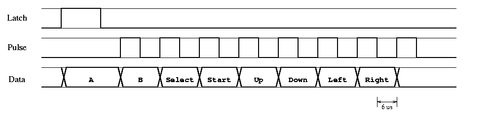

# MinoSweeper

MinoSweeper (LGPL) is a project created as part of the "Introduction to Embedded Programming" classes, in order to acquire a grade.

The name "MinoSweeper" was chosen to represent the idea of Minesweeper using an ESP32-C3-DevKitM-1 circuit board, the NES Controller for controls, A PBM (Passive Buzzer Module) and an LCD 240x320 IPS display to graphically render the game.

[]

## Hardware Components

The following hardware components were used:

* [ESP32-C3-DevKitM-1](https://amzn.eu/d/9a1SwUs)
* USB-A to Micro-USB-B Cable (Power for ESP32-C3-DevKitM-1)
* [NES Extension Cord](https://www.micomputer.es/en/nes/450-super-nintendo-extension-cable.html)
* [WaveShare 2-inch LCD Display (240x320 IPS, 3.3V with SPI Interface)](https://www.waveshare.com/wiki/2inch_LCD_Module)
* [Passive Buzzer Module](https://www.az-delivery.de/products/buzzer-modul-passiv)
* Male-To-Male Pin Connectors
* Breadboard
* Soldering Equipment

---

## Software Architecture

The project (ESP-IDF v5.4.0) is organized into several modules, each with a specific responsibility. This separation of concerns makes the code easier to manage, debug, and extend.

*   `main.c`: The main entry point of the application. It contains the primary game loop, handles initialization of all modules, and processes player input.
*   `gamelogic.c/h`: Manages the game's state. It is responsible for creating the board, placing bombs, handling the logic of revealing and flagging cells, and determining win/loss conditions. It has no knowledge of graphics or hardware.
*   `gamerender.c/h`: Responsible for all rendering. It takes the current game state from `gamelogic` and draws the game board, cursor, and UI text onto a framebuffer.
*   `lcd_st7789_driver.c/h`: A low-level driver for the ST7789 LCD screen. It handles the SPI communication and provides primitive drawing functions like `draw_box`, `draw_string`, and `draw_framebuffer`.
*   `nes_controller.c/h`: A hardware driver for the NES controller. It implements the specific serial communication protocol required to read the button states.
*   `sound_module.c/h`: Controls the passive buzzer to provide auditory feedback, such as beeps for cursor movement and melodies for win/loss events.
*   `font.h`: Contains the bitmap data for the 8x12 font used to render text and numbers.

---

## How to Play

The game is controlled using a standard NES controller.

*   **D-Pad (Up, Down, Left, Right)**: Move the cursor on the game board.
*   **A Button**: Reveal the cell currently under the cursor.
*   **B Button**: Place or remove a flag on the cell under the cursor.
*   **Start Button**: After a game is won or lost, press Start to begin a new game.

---

## Explanation of NES Controller Communication

The NES console uses a polling mechanism instead of interupts, with a frequency of 60Hz (this coincides with NES consoles rendering at 60FPS). Inside the controller is an internal 8-bit parallel-to-serial shift register (4021 IC). This allows to have all eight button states to be latched into the register simultaneously (parallel) and then read out one bit at the time (serial). [[1]](https://www.nesdev.org/wiki/Standard_controller#Hardware)

The NES console sends out a short HIGH-signal (12µs) through the Latch wire to the controller. This causes the shift register to store all eight button states simultaneously. After 6µs, the NES sends 8 HIGH-signals through the Clock wire to the controller, 12µs per full cycle, 50% duty cycle. At each clock cycle, the button states are read out from the shift register bit-by-bit in the following sequence: A, B, Select, Start, Up, Down, Left, Right. Data will assert ground if a button was pressed (= negative true). [[2]](https://tresi.github.io/nes/)

### Figuring out the NES extension cord pinout

Given that there was no pinout issued by the manufacturer, it was required to open up the female end of the extension cord. For that, we need to look at the actual NES Controller pinout, so we can compare and figure out which wire is which.

Based on this, we can look at the pinout at the female end from the extension cord.

---

## Game Logic Algorithm

The core game logic for MinoSweeper is implemented in `gamelogic.c` and is designed to be completely independent of the rendering or input handling modules. It manages the game state, the board, and the rules of Minesweeper.

### Board Representation

The game uses two separate 2D arrays to manage the board state:

1.  `static char solution_board[10][10]`: This is the internal "master" board that holds the complete solution.
    *   A bomb is represented by the character `'x'`.
    *   A safe cell is represented by a character from `'0'` to `'8'`, indicating the number of bombs in its eight neighboring cells.

2.  `static cell_state_t player_board[10][10]`: This board represents the player's view and progress. Each cell can be in one of three states defined by the `cell_state_t` enum:
    *   `CELL_STATE_HIDDEN`: The cell has not been interacted with.
    *   `CELL_STATE_REVEALED`: The player has cleared this cell.
    *   `CELL_STATE_FLAGGED`: The player has marked this cell as a potential bomb.

### Game Initialization (`gamelogic_init`)

When a new game starts, the `gamelogic_init()` function sets up the board in three steps:

1.  **Board Reset**: Both the `solution_board` and `player_board` are cleared. The `player_board` is filled with `CELL_STATE_HIDDEN`, and the `solution_board` is zeroed out.
2.  **Random Bomb Placement**: The algorithm randomly places a predefined number of bombs (`BOMB_AMOUNT`) onto the `solution_board`. It ensures that a bomb is not placed on a cell that already contains one.
3.  **Adjacent Bomb Calculation**: After all bombs are placed, the algorithm iterates through every cell of the `solution_board`. For each cell that is not a bomb, it checks its eight neighbors. It counts how many of these neighbors are bombs and stores that count (as a character, e.g., `'3'`) in the cell.

### Gameplay Mechanics

#### Revealing a Cell (`gamelogic_reveal_cell`)

This is the primary action in the game. When a player reveals a cell:
*   **If the cell contains a bomb (`'x'`)**: The game is over. The game state is immediately set to `GAME_STATE_LOST`.
*   **If the cell contains a number (`'1'`-`'8'`)**: The cell's state in `player_board` is simply changed to `CELL_STATE_REVEALED`.
*   **If the cell is empty (`'0'`)**: A **flood fill** algorithm is triggered. This is a recursive function that reveals the empty cell and then automatically calls `gamelogic_reveal_cell` for all of its eight neighbors. This process continues until it reaches cells that have adjacent bombs (i.e., are numbered `'1'`-`'8'`), which are also revealed but do not continue the recursion. This creates the classic effect of clearing large empty areas at once.

#### Toggling a Flag (`gamelogic_toggle_flag`)

This function allows the player to mark or unmark cells.
*   If a cell is `CELL_STATE_HIDDEN`, it becomes `CELL_STATE_FLAGGED`.
*   If it is already `CELL_STATE_FLAGGED`, it reverts to `CELL_STATE_HIDDEN`.
*   This action has no effect on an already `CELL_STATE_REVEALED` cell.

### Win and Loss Conditions

*   **Loss Condition**: A loss occurs the moment a player reveals a cell containing a bomb.
*   **Win Condition (`check_for_win`)**: A win is achieved when all non-bomb cells on the board have been revealed. The `check_for_win()` function is called after every successful reveal or flag action. It scans the entire board, comparing the `solution_board` and `player_board`. If it finds that every cell that is not a bomb in the solution has been set to `CELL_STATE_REVEALED` in the player's view, it changes the game state to `GAME_STATE_WON`.
